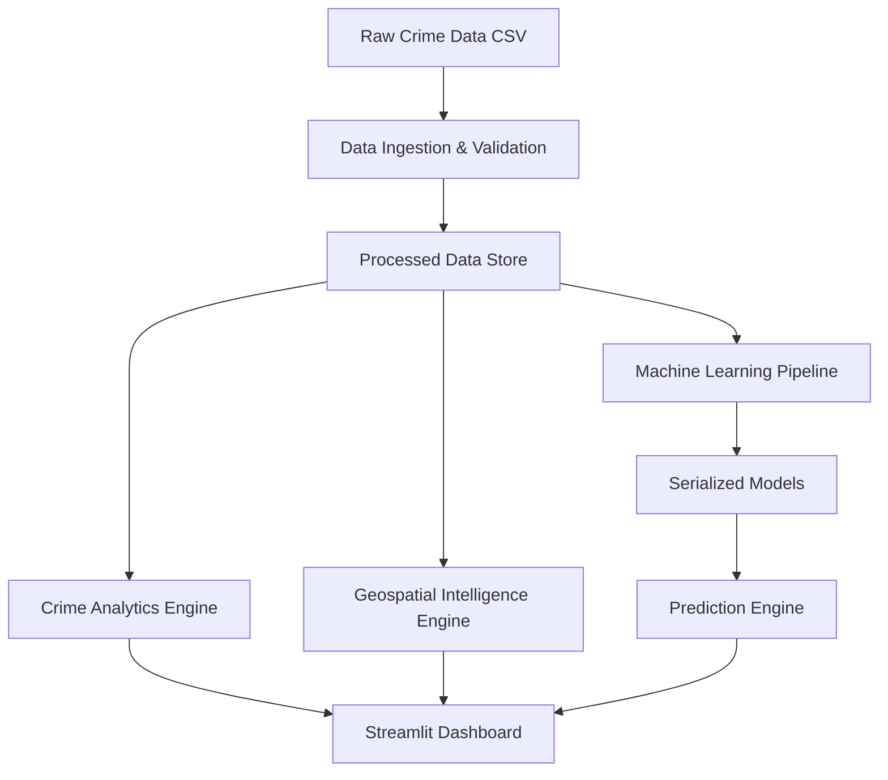

# HawkEye Roadmap

AI-powered crime intelligence, hotspot detection, and predictive analytics platform.

## Architecture Overview

## Phases

### [x] Phase 1: Data Ingestion System
- **Status**: In Progress
- **Key Features**: Schema checking, coordinate validation, missing value reports, duplicate removal, logging.

### [ ] Phase 2: Crime Analytics Engine
- **Status**: Not Started
- **Key Features**: Spatial-temporal analysis, trend profiling, seasonal patterns.

### [ ] Phase 3: Geospatial Intelligence Engine
- **Status**: Not Started
- **Key Features**: Hotspot heatmaps, interactive Folium maps, coordinate verification.

### [ ] Phase 4: Machine Learning System
- **Status**: Not Started
- **Key Features**: Feature engineering, classification/regression models, evaluation metrics, pipeline saving.

### [ ] Phase 5: Prediction Engine
- **Status**: Not Started
- **Key Features**: Spatial risk assessment, hourly/weekly crime forecasting.

### [ ] Phase 6: Interactive Dashboard
- **Status**: Not Started
- **Key Features**: Streamlit interface, live filters, predictive overlays.

### [ ] Phase 7: Repository Quality & Final Polish
- **Status**: Not Started
- **Key Features**: Setup guides, full documentation, final validation tests.
